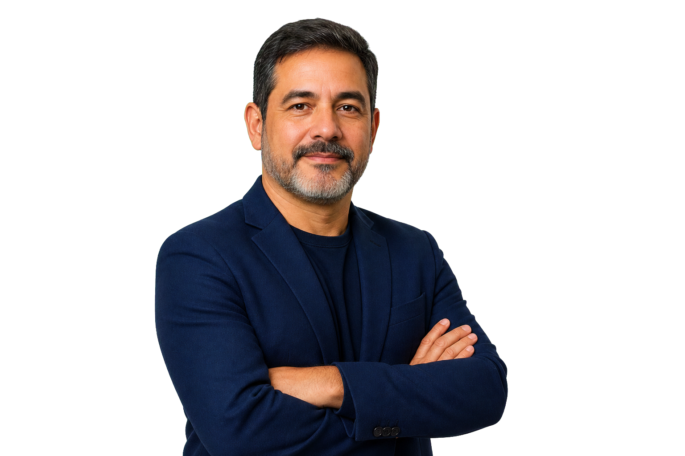

# Briefing para GitHub Copilot — Atualização do Portfólio Cassiano Lamarc

Modifique o projeto HTML, CSS e JavaScript existente para evoluir a landing page do portfólio de **Cassiano Lamarc Lima de Oliveira**, Senior Full Stack Software Engineer especializado em **.NET, Angular, IA, Cloud, SQL Server e PostgreSQL**.

## Objetivo da atualização

A landing page deve ficar mais completa, visualmente mais premium e mais alinhada ao currículo profissional de Cassiano.

A página deve continuar funcionando como uma landing page bilíngue, com alternância entre **Português** e **Inglês** via botão `PT | EN`.

Todos os textos, botões, seções e links relevantes devem respeitar o idioma selecionado.

---

# 1. Hero com espaço para foto profissional

Na primeira seção da página, adicionar uma área reservada para foto profissional.

## Comportamento visual

### Desktop e Tablet

A primeira seção deve ter layout em duas colunas:

* Coluna esquerda: conteúdo textual
* Coluna direita: foto profissional

A imagem deve parecer integrada ao mesmo background do site.

Criar um espaço reservado para uma foto de Cassiano em postura profissional, por exemplo:

```text
Foto profissional em postura confiante, de braços cruzados.
```

Usar placeholder no HTML:

```html

```

A imagem deve ter:

* Fundo transparente ou integrado ao background
* Moldura elegante
* Glow sutil
* Bordas arredondadas
* Visual premium
* Boa composição ao lado do texto

### Mobile

Na versão mobile, a imagem **não deve ser exibida**.

Usar CSS:

```css
@media (max-width: 768px) {
  .hero-photo {
    display: none;
  }
}
```

---

# 2. Atualizar informações principais do Hero

## Português

Título:

```text
Cassiano Lamarc
```

Headline:

```text
Senior Full Stack Software Engineer
```

Subheadline:

```text
Especialista em .NET, Angular, IA, Cloud e arquitetura de software para aplicações corporativas escaláveis.
```

Descrição:

```text
Engenheiro de Software Full Stack Sênior com mais de 8 anos de experiência no desenvolvimento de aplicações web escaláveis, APIs robustas, sistemas financeiros, plataformas SaaS, soluções cloud-native e produtos digitais de alta performance.
```

Botões:

```text
Ver experiências
Baixar currículo
Entrar em contato
```

## Inglês

Headline:

```text
Senior Full Stack Software Engineer
```

Subheadline:

```text
Specialized in .NET, Angular, AI, Cloud, and software architecture for scalable enterprise applications.
```

Descrição:

```text
Senior Full Stack Software Engineer with 8+ years of experience building scalable web applications, robust APIs, financial systems, SaaS platforms, cloud-native solutions, and high-performance digital products.
```

Botões:

```text
View experience
Download resume
Get in touch
```

---

# 3. Botão para baixar currículo conforme idioma

Adicionar botão `Baixar currículo` / `Download resume`.

O botão deve baixar o arquivo correto conforme o idioma ativo.

## Arquivos

Colocar os currículos na pasta:

```text
assets/docs/
```

Com os nomes:

```text
cassiano-lamarc-cv-pt.pdf
cassiano-lamarc-cv-en.pdf
```

## Comportamento JS

Quando o idioma estiver em português:

```javascript
downloadButton.href = "assets/docs/cassiano-lamarc-cv-pt.pdf";
downloadButton.download = "Cassiano-Lamarc-CV-PT.pdf";
```

Quando o idioma estiver em inglês:

```javascript
downloadButton.href = "assets/docs/cassiano-lamarc-cv-en.pdf";
downloadButton.download = "Cassiano-Lamarc-CV-EN.pdf";
```

---

# 4. Remover formulário de contato

Remover completamente a seção de formulário com:

* Nome
* E-mail
* Mensagem
* Botão enviar mensagem

Substituir por uma seção simples, elegante e direta de contato.

## Português

Título:

```text
Contato
```

Texto:

```text
Entre em contato para oportunidades remotas, internacionais, consultorias, projetos .NET, Angular, cloud, IA ou arquitetura de software.
```

Links:

```text
E-mail: cacassiano2011@gmail.com
LinkedIn
GitHub
WhatsApp
```

## Inglês

Título:

```text
Contact
```

Texto:

```text
Get in touch for remote opportunities, international roles, consulting, .NET projects, Angular applications, cloud solutions, AI initiatives, or software architecture.
```

Links:

```text
Email: cacassiano2011@gmail.com
LinkedIn
GitHub
WhatsApp
```

---

# 5. WhatsApp com mensagem pronta em inglês

O link do WhatsApp deve abrir com uma mensagem já preenchida.

Número:

```text
+55 71 98320-2118
```

Link:

```text
https://wa.me/5571983202118?text=Hi%2C%20I%20came%20here%20from%20your%20website%20and%20I%20would%20like%20to%20talk%20about%20a%20job%20opportunity.
```

Texto da mensagem:

```text
Hi, I came here from your website and I would like to talk about a job opportunity.
```

---

# 6. Links oficiais

Usar os links reais:

```text
LinkedIn: https://linkedin.com/in/cassiano-lamarc-493964129
GitHub: https://github.com/cassiano-lamarc
Email: mailto:cacassiano2011@gmail.com
WhatsApp: https://wa.me/5571983202118?text=Hi%2C%20I%20came%20here%20from%20your%20website%20and%20I%20would%20like%20to%20talk%20about%20a%20job%20opportunity.
```

---

# 7. Experiências com mais detalhes

Atualizar a seção de experiências para refletir o currículo com mais profundidade.

A seção deve continuar usando o comportamento especial em JavaScript:

* Ao chegar na seção de experiências, a tela fica visualmente estática.
* Ao rolar o mouse, a página não avança imediatamente.
* As experiências mudam uma a uma.
* Ao chegar na última experiência, o scroll normal continua.
* Ao rolar para cima, as experiências voltam na ordem inversa.

## Experiências em ordem cronológica inversa

### G4F — Software Engineer

Período:

```text
Nov 2023 – Atual
```

Clientes/projetos:

```text
SEFAZ-BA
Ambev / AB InBev
```

Português:

```text
Atuação em projetos estratégicos para grandes instituições brasileiras, incluindo sistemas financeiros, bancários e plataformas corporativas de análise de indicadores.

Na SEFAZ-BA, trabalhou em sistema financeiro e bancário mission-critical utilizado para controle de contas governamentais e operações fiscais, desenvolvendo serviços backend seguros e escaláveis com .NET 6 e .NET 8, frontend com Angular 12 a 19 e APIs orientadas por Clean Architecture.

Na Ambev, atuou no desenvolvimento de uma plataforma de gestão de KPIs para monitoramento de indicadores estratégicos e desempenho de negócio, com foco em performance, escalabilidade, filtros, visualizações analíticas e padronização de componentes frontend.
```

Inglês:

```text
Worked on strategic projects for major Brazilian institutions, including financial systems, banking platforms, and enterprise KPI analytics solutions.

At SEFAZ-BA, contributed to a mission-critical financial and banking control system used to manage government accounts and fiscal operations, building secure and scalable backend services with .NET 6 and .NET 8, frontend solutions with Angular 12 to 19, and APIs guided by Clean Architecture.

At Ambev, worked on a KPI management platform for monitoring business performance and strategic indicators, focusing on performance, scalability, filtering, analytics visualization, and frontend component standardization.
```

Tecnologias:

```text
.NET 6, .NET 8, Angular 12–19, PostgreSQL, SQL Server, Azure DevOps, Clean Architecture, Scrum
```

---

### Mottu — Software Engineer

Período:

```text
Jan 2022 – Nov 2023
```

Cliente/projeto:

```text
Mottu Entregas
```

Português:

```text
Atuação na plataforma Mottu Entregas, sistema logístico de grande escala utilizado em operações de delivery em todo o Brasil.

Desenvolveu e manteve APIs, fluxos frontend e funcionalidades para operações de entrega em tempo real, contribuindo para melhoria de performance, confiabilidade e estabilidade em ambiente de produção.
```

Inglês:

```text
Worked on Mottu Entregas, a large-scale logistics and delivery platform operating nationwide in Brazil.

Built and maintained APIs, frontend workflows, and real-time delivery features, contributing to system performance, reliability, and production stability.
```

Tecnologias:

```text
.NET, Angular 9+, SQL Server, PostgreSQL, GitHub, Azure DevOps
```

---

### LeadLovers — Software Engineer

Período:

```text
Ago 2020 – Dez 2021
```

Cliente/projeto:

```text
LeadLovers
```

Português:

```text
Atuação em startup SaaS de marketing digital, trabalhando em funcionalidades para captura de leads, email marketing, automações e landing pages dinâmicas.

Contribuiu para desenvolvimento de funcionalidades escaláveis, manutenção de sistemas legados e modernização gradual de componentes.
```

Inglês:

```text
Worked at a digital marketing SaaS startup, developing features for lead capture, email marketing, automation flows, and dynamic landing pages.

Contributed to scalable feature development, legacy system maintenance, and gradual component modernization.
```

Tecnologias:

```text
.NET Framework MVC, .NET Core, AngularJS, SQL Server
```

---

### Capgemini — Software Engineer

Período:

```text
Jul 2019 – Ago 2020
```

Clientes:

```text
Bradesco
Banco do Nordeste
FIEB
Hydro
```

Português:

```text
Consultor de software em projetos corporativos para grandes empresas brasileiras, atuando em ambientes com requisitos rigorosos de compliance, integrações e grandes bases de código.

Trabalhou em diferentes domínios de negócio, apoiando desenvolvimento, manutenção evolutiva e sustentação de aplicações empresariais.
```

Inglês:

```text
Software consultant working on enterprise projects for major Brazilian companies, operating in environments with strict compliance requirements, integrations, and large codebases.

Worked across different business domains, supporting development, evolutionary maintenance, and enterprise application sustainability.
```

Tecnologias:

```text
.NET, Angular, SQL Server
```

---

### Sonda — Software Engineer

Período:

```text
Nov 2018 – Jul 2019
```

Cliente:

```text
Petrobras
```

Português:

```text
Alocado na Petrobras, atuando na manutenção e evolução de mais de 10 aplicações corporativas.

Responsável por ajustes, melhorias, correções e evolução técnica de sistemas internos, com foco em estabilidade e continuidade operacional.
```

Inglês:

```text
Contracted to Petrobras, maintaining and evolving more than 10 enterprise applications.

Responsible for improvements, fixes, maintenance, and technical evolution of internal systems, focusing on stability and operational continuity.
```

Tecnologias:

```text
.NET, JavaScript
```

---

### Salut — Software Developer

Período:

```text
Dez 2017 – Nov 2018
```

Cliente:

```text
Salut Hortifruti
```

Português:

```text
Primeira atuação profissional focada em modernização de sistemas legados e desenvolvimento de aplicações internas.

Realizou migração de sistemas VB6 para C# Windows Forms, desenvolvimento de Web Forms, integrações com banco de dados e melhorias em sistemas operacionais da empresa.
```

Inglês:

```text
Early professional role focused on legacy system modernization and internal application development.

Migrated systems from VB6 to C# Windows Forms, developed Web Forms applications, implemented database integrations, and improved operational systems.
```

Tecnologias:

```text
C#, Web Forms, Windows Forms, SQL Server, JavaScript, Bootstrap
```

---

# 8. Seção de clientes com carrossel de logos

Criar uma seção próxima à seção de experiências, preferencialmente logo antes ou logo depois.

Título PT:

```text
Clientes e empresas atendidas
```

Título EN:

```text
Clients and companies served
```

Descrição PT:

```text
Experiência em projetos para empresas de diferentes segmentos, incluindo financeiro, bancário, indústria, governo, saúde, logística, marketing digital e tecnologia.
```

Descrição EN:

```text
Experience delivering projects across financial services, banking, industry, government, healthcare, logistics, digital marketing, and technology.
```

## Lista de clientes

```text
Salut Hortifruti
Petrobras
Banco do Nordeste
FIEB
Bradesco
Hydro
LeadLovers
Mottu
Campaign Deputy
Itaú
SEFAZ-BA
Unimed
Ambev
Zeroum.bet
```

## Carrossel

Criar um carrossel horizontal infinito de logos.

Requisitos:

* Movimento contínuo e suave
* Pausar ao passar o mouse
* Responsivo
* Fundo em cards translúcidos
* Caso a logo não exista, usar placeholder textual elegante com o nome da empresa
* Duplicar a lista no HTML ou via JS para criar efeito infinito

Estrutura sugerida:

```html
<section id="clients" class="clients-section">
  <div class="section-header">
    <span class="section-kicker" data-i18n="clients.kicker">Clientes</span>
    <h2 data-i18n="clients.title">Clientes e empresas atendidas</h2>
    <p data-i18n="clients.description">
      Experiência em projetos para empresas de diferentes segmentos.
    </p>
  </div>

  <div class="logo-carousel" aria-label="Clientes e empresas atendidas">
    <div class="logo-track">
      <div class="logo-card"></div>
      <div class="logo-card"></div>
      <div class="logo-card"></div>
      <div class="logo-card"></div>
      <div class="logo-card"></div>
      <div class="logo-card"></div>
      <div class="logo-card"></div>
      <div class="logo-card"></div>
      <div class="logo-card"></div>
      <div class="logo-card"></div>
      <div class="logo-card"></div>
      <div class="logo-card"></div>
      <div class="logo-card"></div>
      <div class="logo-card"></div>
    </div>
  </div>
</section>
```

CSS sugerido:

```css
.logo-carousel {
  overflow: hidden;
  width: 100%;
  mask-image: linear-gradient(to right, transparent, #000 10%, #000 90%, transparent);
}

.logo-track {
  display: flex;
  gap: 1rem;
  width: max-content;
  animation: scrollLogos 35s linear infinite;
}

.logo-carousel:hover .logo-track {
  animation-play-state: paused;
}

.logo-card {
  min-width: 160px;
  height: 92px;
  display: flex;
  align-items: center;
  justify-content: center;
  padding: 1rem;
  border: 1px solid rgba(255,255,255,0.12);
  border-radius: 18px;
  background: rgba(255,255,255,0.06);
  backdrop-filter: blur(14px);
}

.logo-card img {
  max-width: 120px;
  max-height: 54px;
  object-fit: contain;
  filter: grayscale(1);
  opacity: 0.82;
  transition: 0.3s ease;
}

.logo-card:hover img {
  filter: grayscale(0);
  opacity: 1;
  transform: scale(1.04);
}

@keyframes scrollLogos {
  from {
    transform: translateX(0);
  }
  to {
    transform: translateX(-50%);
  }
}
```

---

# 9. IA, Cloud e arquitetura com mais destaque

Atualizar seção de tecnologias para conter agrupamentos.

## Português

### Backend

```text
C#, .NET, ASP.NET Core, Web APIs, Entity Framework Core, DDD, CQRS, REST
```

### Frontend

```text
Angular 9–19, TypeScript, JavaScript, PrimeNG, Angular Material, Bootstrap
```

### Banco de dados

```text
SQL Server, PostgreSQL, Redis Cache
```

### Cloud & DevOps

```text
Azure DevOps, GitHub Actions, CI/CD, Docker, Kubernetes, GitFlow
```

### IA & Inovação

```text
Pós-graduação em IA para Devs pela FIAP, experiência acadêmica com chatbot para unidades públicas de saúde e interesse aplicado em soluções inteligentes para produtos digitais.
```

### Arquitetura & Boas práticas

```text
Clean Architecture, Hexagonal Architecture, SOLID, TDD, Repository Pattern, Clean Code
```

### Testes & Observabilidade

```text
xUnit, NUnit, Jasmine, Karma, Datadog
```

## Inglês

### Backend

```text
C#, .NET, ASP.NET Core, Web APIs, Entity Framework Core, DDD, CQRS, REST
```

### Frontend

```text
Angular 9–19, TypeScript, JavaScript, PrimeNG, Angular Material, Bootstrap
```

### Databases

```text
SQL Server, PostgreSQL, Redis Cache
```

### Cloud & DevOps

```text
Azure DevOps, GitHub Actions, CI/CD, Docker, Kubernetes, GitFlow
```

### AI & Innovation

```text
Postgraduate studies in AI for Developers at FIAP, academic experience building a chatbot for public healthcare units, and applied interest in intelligent solutions for digital products.
```

### Architecture & Best Practices

```text
Clean Architecture, Hexagonal Architecture, SOLID, TDD, Repository Pattern, Clean Code
```

### Testing & Observability

```text
xUnit, NUnit, Jasmine, Karma, Datadog
```

---

# 10. Locais aceitáveis de trabalho

Manter a seção, mas atualizar os textos.

## Português

```text
Remoto internacional
Remoto nacional
Híbrido, dependendo da localização
Presencial, mediante proposta e localização
Disponível para realocação
```

## Inglês

```text
International remote
Brazil-based remote
Hybrid, depending on location
On-site, depending on proposal and location
Open to relocation
```

---

# 11. Tradução PT | EN

Garantir que todas as novas seções estejam no objeto de tradução JavaScript.

Exemplo:

```javascript
const translations = {
  pt: {
    hero: {},
    about: {},
    experience: {},
    clients: {},
    skills: {},
    workPreferences: {},
    contact: {}
  },
  en: {
    hero: {},
    about: {},
    experience: {},
    clients: {},
    skills: {},
    workPreferences: {},
    contact: {}
  }
};
```

O botão `PT | EN` deve:

* Alternar todos os textos
* Atualizar o botão de currículo
* Manter links sociais funcionando
* Atualizar labels e títulos de seções

---

# 12. Ajustes finais de layout

Garantir que o site continue:

* Responsivo
* Elegante
* Moderno
* Profissional
* Com scroll suave
* Com boa experiência mobile
* Com visual premium para portfólio sênior
* Com foco claro em .NET, Angular, IA, Cloud, SQL Server e PostgreSQL

Não usar frameworks. Usar apenas:

```text
HTML
CSS
JavaScript puro
```
